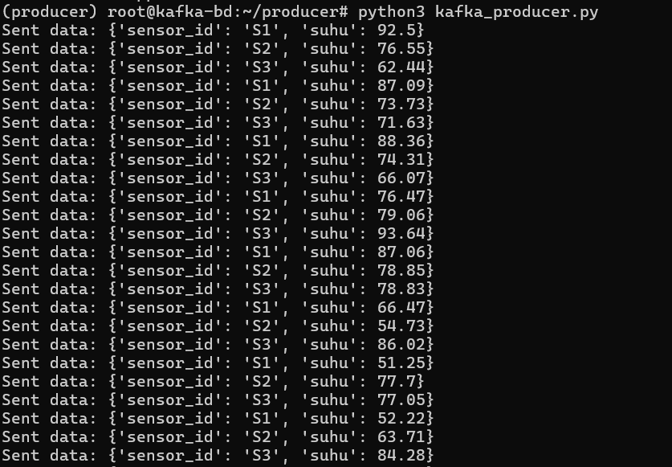
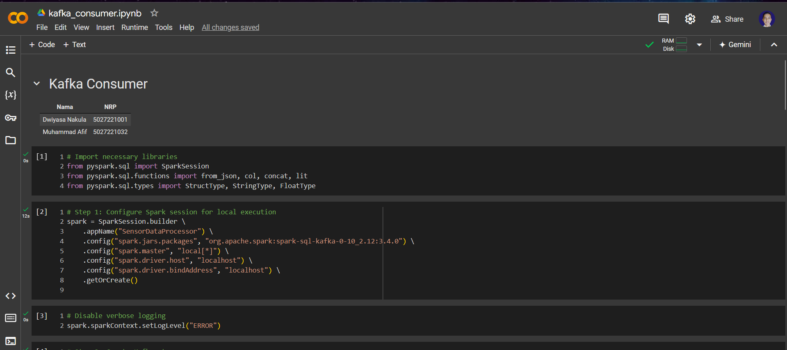
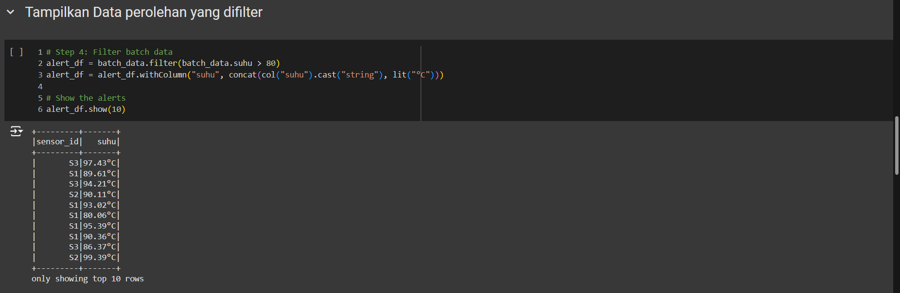

# Kafka Study-Case

### Mata Kuliah Big Data - Kelas A

| Nama                    | NRP        |
| ----------------------- | ---------- |
| Dwiyasa Nakula   | 5027221001 |
| Muhammad Afif | 5027221032 |

## Kasus Permasalahan

- Pabrik membutuhkan aliran data sensor yang dapat diteruskan ke layanan analitik atau dashboard secara langsung.

- Apache Kafka akan digunakan untuk menerima dan mengalirkan data suhu, sementara PySpark akan digunakan untuk mengolah dan memfilter data tersebut.

## Tugas

1. **Buat Topik Kafka untuk Data Suhu:**

    - Buat topik di Apache Kafka bernama "sensor-suhu" yang akan menerima data suhu dari sensor-sensor mesin.

2. **Simulasikan Data Suhu dengan Producer:**

    - Buat producer sederhana yang mensimulasikan data suhu dari beberapa sensor mesin (misalnya, 3 sensor berbeda).

    - Setiap data suhu berisi ID sensor dan suhu saat ini (misalnya, sensor_id: S1, suhu: 70°C), dan dikirim setiap detik ke topik "sensor-suhu".

3. **Konsumsi dan Olah Data dengan PySpark:**

    - Buat consumer di PySpark yang membaca data dari topik "sensor-suhu".

    - Filter data suhu yang berada di atas 80°C, sebagai indikator suhu yang perlu diperhatikan.

4. **Output dan Analisis:**

    - Cetak data yang suhu-nya melebihi 80°C sebagai tanda peringatan sederhana di console.

## Langkah Pengerjaan

### Kebutuhan

Untuk memudahkan pengerjaan dan replika, kami melakukan pengerjaan tugas ini melalui environment berikut:

- `Produser`: Digital Ocean Image Ubuntu 22.04
- `Konsumen`: Google Colab (untuk menghindari penginstalan pySpark di local)

Kelemahan dari environment ini adalah konsumen tidak dapat melakukan streaming data. Google colab pada dasarnya mencegah data streaming sehingga **sangat direkomendasikan** untuk menginstal pySpark pada local apabila memori komputer cukup.

### Pengaturan Produser

1. Install Java pada Ubuntu

```sh
sudo apt update 
sudo apt install default-jdk
```

2. Periksa versi Java

```sh
java --version
```

Output

```sh
openjdk 11.0.24 2024-07-16
OpenJDK Runtime Environment (build 11.0.24+8-post-Ubuntu-1ubuntu322.04)
OpenJDK 64-Bit Server VM (build 11.0.24+8-post-Ubuntu-1ubuntu322.04, mixed mode, sharing)
```

3. Download `Apache Kafka`

```sh
wget https://downloads.apache.org/kafka/3.4.0/kafka_2.12-3.4.0.tgz
```

Kemudian ekstrak filenya

```sh
tar xzf kafka_2.12-3.4.0.tgz 
mv kafka_2.12-3.4.0 /root/kafka
```

4. Konfigurasi `System unit File` untuk `zookeeper`

```bash
nano /etc/systemd/system/zookeeper.service
```

- `zookeeper.service`

```conf
[Unit]
Description=Apache Zookeeper server
Documentation=http://zookeeper.apache.org
Requires=network.target remote-fs.target
After=network.target remote-fs.target
[Service]
Type=simple
ExecStart=/root/kafka/bin/zookeeper-server-start.sh /root/kafka/config/zookeeper.properties
ExecStop=/root/kafka/bin/zookeeper-server-stop.sh
Restart=on-abnormal
[Install]
WantedBy=multi-user.target
```

5. Konfigurasi `server.properties`

```sh
nano ~/kafka/config/server.properties
```

- `server.properties`
```bash
############################# Server Basics #############################

# The id of the broker. This must be set to a unique integer for each broker.
broker.id=0

############################# Socket Server Settings #############################

listeners=PLAINTEXT://[YOUR_DO_IP]:9092

# Listener name, hostname and port the broker will advertise to clients.
advertised.listeners=PLAINTEXT://[YOUR_DO_IP]:9092

# The number of threads that the server uses for receiving requests from the network and sending responses to the network
num.network.threads=3

# The number of threads that the server uses for processing requests, which may include disk I/O
num.io.threads=8

# The send buffer (SO_SNDBUF) used by the socket server
socket.send.buffer.bytes=102400

# The receive buffer (SO_RCVBUF) used by the socket server
socket.receive.buffer.bytes=102400

# The maximum size of a request that the socket server will accept (protection against OOM)
socket.request.max.bytes=104857600


############################# Log Basics #############################

# A comma separated list of directories under which to store log files
log.dirs=/tmp/kafka-logs

# the brokers.
num.partitions=3

# The number of threads per data directory to be used for log recovery at startup and flushing at shutdown.
num.recovery.threads.per.data.dir=1

############################# Internal Topic Settings  #############################

offsets.topic.replication.factor=1
transaction.state.log.replication.factor=1
transaction.state.log.min.isr=1

############################# Log Retention Policy #############################

# The minimum age of a log file to be eligible for deletion due to age
log.retention.hours=168

# The interval at which log segments are checked to see if they can be deleted according
# to the retention policies
log.retention.check.interval.ms=300000

############################# Zookeeper #############################

zookeeper.connect=localhost:2181

# Timeout in ms for connecting to zookeeper
zookeeper.connection.timeout.ms=18000


############################# Group Coordinator Settings #############################

group.initial.rebalance.delay.ms=0
```

6. Konfigurasi `System unit File` untuk `kafka`

```bash
nano /etc/systemd/system/kafka.service
```

- `kafka.service`

```conf
[Unit]
Description=Apache Kafka Server
Documentation=http://kafka.apache.org/documentation.html
Requires=zookeeper.service
[Service]
Type=simple
Environment="JAVA_HOME=/usr/lib/jvm/java-1.11.0-openjdk-amd64"
ExecStart=/root/kafka/bin/kafka-server-start.sh /root/kafka/config/server.properties
ExecStop=/root/kafka/bin/kafka-server-stop.sh
[Install]
WantedBy=multi-user.target
```

7. Jalankan `zookeeper` dan `kafka`

```bash
systemctl start zookeeper
```

```bash
systemctl start kafka
```

8. Cek status `kafka`

```bash
systemstl status kafka
```

Apabila ditemukan error, hapus data `meta.properties` kafka, kemudian restart akfka.

```bash
rm /tmp/kafka-logs/meta.properties
```

9. Install requirement python (disarankan menggunakan python venv)

```bash
python3 -m pip install -r requirement.txt
```

9. Salin kode python pada [producer](./python/producer/kafka_producer.py)

10. Atur `BOOTSTRAP_SERVER` dan `TOPIC`

```py
BOOTSTRAP_SERVER='YOUR_DO_IP:9092' # Gunakan localhost jika local
TOPIC='iot-suhu'
```

11. Jalankan kode python

```bash
python3 kafka_producer.py
```

12. Kode akan mengirimkan data dummy setiap detik



### Pengaturan Konsumen

1. Salin file ipynb [konsumen](./python/consumer/kafka_consumer.ipynb) pada Google Colab

2. Ubah bootstrap_server dan topic sesuai kebutuhan

- `Step 2`
```py
# Step 2: Create Kafka stream
sensor_data = spark \
    .readStream \
    .format("kafka") \
    .option("kafka.bootstrap.servers", "YOUR_BOOTSTRAP_SERVER") \
    .option("subscribe", "YOUR_TOPIC") \
    .load()
```

- `Step 3`
```py
batch_data = spark \
    .read \
    .format("kafka") \
    .option("kafka.bootstrap.servers", "YOUR_BOOTSTRAP_SERVER") \
    .option("subscribe", "YOUR_TOPIC") \
    .load() \
    .selectExpr("CAST(value AS STRING) as json") \
    .select(from_json(col("json"), schema).alias("data")) \
    .select("data.sensor_id", "data.suhu")

# Show a small sample
batch_data.show(10)
```

3. Jalankan semua sel ipynb



4. Data akan emngambil data dari topic, kemudian hasil yang difilter akan ditampilkan

